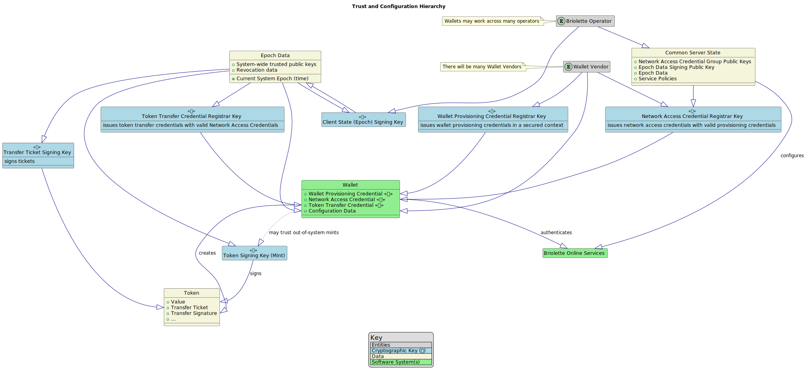

# Briolette: A Technical Overview
May 2023

---

## Agenda

- What is it?
- Concepts
- Transactions
- Wallet Credentials
- Tickets
- Token minting
- Transaction prerequisites
- Services 
- Trust configuration
- Double spending
- Cryptographic Primitives
- Revocation

---

## What is it?

briolette is a weakly anonymous e-cash scheme, which
- Provides a physical cash-like user experience
  - but with recovery and change-making
- Provides abuse resistance, detection, and response for operators
- Built around three core cryptographic interfaces:
  - Randomizable credentials
  - Selective linkability, of
  - Signatures of knowledge
- And it's open source!

---
## Concepts

- Tokens are certificates of value, certified by a central authority
  - They carry with them a secure chain of provenance back to issuance
- Tokens are directly transferred between participant wallets, offline or on
- Wallets are authorized software and hardware with certified pseudonymous addresses and a secret key
- There is no required linkage between the pseudonymous addresses and a human
- Token provenance is shared with the central authority at intervals
  - Enabling double spending detection and response

---
## Transactions

- For every transaction, 
  - there will be one sender and one receiver.
  - The sender will only need to know the pseudonymous address of the receiver
  - The receiver will only wish to receive legitimate tokens they can re-use
    - The sender must prove they are authorized to transact within the system
    - The sender must prove that they hold the credentials for the pseudonymous address that the token was most recently transferred to

---
## Wallet Credentials

Wallets carry two credentials:

1. A network access credential (NAC)
  - Enables access to operator services
  - With selective linkability, enables request throttling
2. A token transfer credential (TTC)
  - Signs token transfers
  - Randomized TTCs create the pseudonymous addresses

---
## Tickets

- Tickets are operator-signed randomized TTCs with policy attributes
  - E.g., revocation group numbers, lifetime, transaction value limits, etc
- Tokens can only be transferred to valid, signed tickets
  - they are used to bind a received token to the wallet
- The next transfer must use the secret key associated with the fixated credential
- Wallets must request tickets from the operator to transact
- Operators can link some tickets together, based on issuance policy, but not all

---
## Token minting

- May be handled by the operator
  - or delegated to regulated entities or even intermediaries
  - delegates may also operate swap and a validator services for tokens they sign
- Tokens must have an initial signature by a known public "mint" key
  - with the ability to assert a value that a wallet trusts
- Wallets may also trust mints that are unknown to the operator
- This enables public and private tokens to intermingle
- Minted tokens may be fiat bearer instruments or cheques

---
## Transactions are now possible

A normal flow may look as follows

  - Initiation handshake (version and system "epoch")
  - Gossip if epochs mismatch
  - Request payment: may include itemized requests and lists of acceptable token types/mints
  - Propose payment: sends the token or tokens proposed to settle
  - Accept proposal: this is used if change making is needed or to reject invalid tokens
  - Send payment: transfer tokens and transmit
  - Confirm payment: acknowledges receipt

Though single-shot payments are possible too.

---
## Services 

A number of additional services must be exposed to fully operate the system

- by the wallet vendors, and
- by the operator (or its delegates)

These services are necessary to sustained operation of the system, but their
up time or performance is not related to transaction settlement or throughput.

---
## Wallet Vendor Services

- _Network Access Credential Registrar_
  - issues the NAC when a wallet registers to use the system
  - likely uses remote attestation to confirm eligibility
  - recommended: support a PQ safe fallback registration system

---
## Operator Services 

- _Transfer Token Credential Registrar_ 
  - enables wallets to generate addresses and transact
- _State server_ 
  - provides updates to the system epoch, configuration, and revocations
- _Clerk server_ 
  - certifies wallet addresses, as "tickets", enabling them to receive tokens
- _Validator server_ 
  - allows wallets to check, and update, a token's global consistency info
- _Swap server_ 
  - allows a wallet to exchange a token for a fresher token

The operator will also likely operate sharded backends to enable longer term state storage and fine-grained metrics.

---
## Optional services

Token recovery:

- Protecting against lost wallets
  - through proactive trusted wallet linkage
    - Another device or even a bank or PIP
- Protecting against expired tokens or tickets
  - allowing the same wallet to prove self-linkage (via NAC)

Ticket KYC service

- e.g., for high value transactions

Online transaction services

- e.g., escrow or merchant ticket certification

---
## Trust configuration

Trust is largely configured by the operator:

- determining which wallet vendors are acceptable
  - By authorizing their network access credential group public keys with its services
- providing wallet vendors with an initial state signing key

The operator's state updates provided to the wallets will
- provide all necessary public keys, and
- their purpose 

---
## Multi-system and multi-mint use

Wallets have some control over who they trust, however:

- to participate in multiple different briolette systems
- to accept tokens from non-operator mints (loyalty points, etc)

---
## Visualized: Trust hierarchy

---
## Double spending prevention

- When tokens are transferred, they require selective linkable signatures
  - dependent on the preceding signature ("basename")
- Secure hardware should ensure a TTC only signs with a given dependent signature once
  - (to avoid infinite storage requirements, token expiration may be used for cleanup)

---
## Secure hardware assurances

Secure hardware should provide

- protected storage of credential secret keys
- support wallet vendor NAC registrar validation
- limit token transfer credentials to signing with a given basename once
  - this implies anti-rollback storage mechanism (monotonic counter, Merkle tree root storage, ...)
- the interfaces and hardware should be built to a laboratory validated standard

---
## Cryptographic primitives

The briolette proof of concept relies on

- EC direct anonymous attestation, and its three building blocks:
  - Randomizable weakly blind signatures -> randomized credentials
  - Linkable indistinguishable tags
  - Signature proofs of knowledge -> transfer signatures
- DAA is used both for the network and token transfer credential
- all other signatures are classic ecdsa (P-256)
- SHA-256 hashes are also employed

Other cryptosystems (PQ) may be used as well as other curves.

---
## Double spending detection

When an operator service is sent a token, it

- checks if the token is valid, then
- checks if the token provenance is a valid known provenance or extension

If a the provenance forks, a double spend has been detected.
- except in one case

---
## Exception case: Splits and change

- Tokens may have forked history
  - if they add a split tag
- Splits allow change to be made from larger value tokens
- Splits are tags on transfers
  - where the value specified is subtracted from the original value
  - and kept with the prior signing ticket
- The operator can choose to enable splits
  - and may do so for < 1.00 values or for any value
- Splits enable efficient transactions 

---
## Double spending response

When a double spend is detected,
- the TTC linkability signature pseudonym is extracted from token
  - this confirms the same double spender created the fork
- the same is extracted from the NAC of the double spender's ticket
- the revocation group numbers are pulled from the ticket
  - and all tickets known issued at the same time
- the revocation groups are pushed into a new state epoch for wallets
- the pseudonyms are pushed to relevant servers to challenge new requests
  - Registrars, ticket clerk, etc.

---
## Wallet state and revocation

- Wallets fetch state at regular intervals
  - If they can't they will receive updates from peers
  - Wallets are required to share state updates before every transaction
- The revocation data in the state is a simple bitfield of revoked groups
- If a payee receives a payer's ticket with a revoked group, it will not transact
- If a payer receives a payee's token with the revoked group in its provenance
  - the revoked ticket must be from within a revocation epoch window

---
## Token global consistency

- Global consistency is how double spending is detected
- It is incentivized by
  - validation of high value or concerning transactions
  - recovery functionality
- It is enforced by
  - token expiration (incl w/ticket modification)
  - maximum token provenance length

---
## Thank you!

This concludes a technical overview of the system

(Keep going for configuration exploration)

---
## Default: treasury model

- All tokens are minted by the operator
  - and initially transferred to a treasury
- Tiered expiration allows the treasury to hold or distribute the tokens
- The tokens are "fiat" currency if the operator is a central bank

---
### Bank note "treasury" model

- Same as treasury, except
  - Each bank operates a mint
  - All bank note tokens are convertible

---
### Bank note account model

- As above except that
  - tokens are minted per account (with a per-account, per-token (encrypted) identifier)
- On withdrawal, the balance is moved to escrow
  - when the token is deposited with another bank, the balances are settled
- The bank may need to operate a swap and validate server depending on the arrangement
  - with the operator

---
### Central bank account model

- As with the bank note account model
  - except there is still only one issuer
  - and the central bank can decide whether to annotate the token
    - or just store a mapping of token base signature to account

---
### Loyalty point model

Within a functioning model from above

  - a merchant setups up a mint
  - distributes its mint key via its loyalty app and merchant partners
  - the point of sales units can then choose to accept loyalty points
    - with some mapping to fiat value
  - the wallet can propose to settle with loyalty points instead of other tokens
