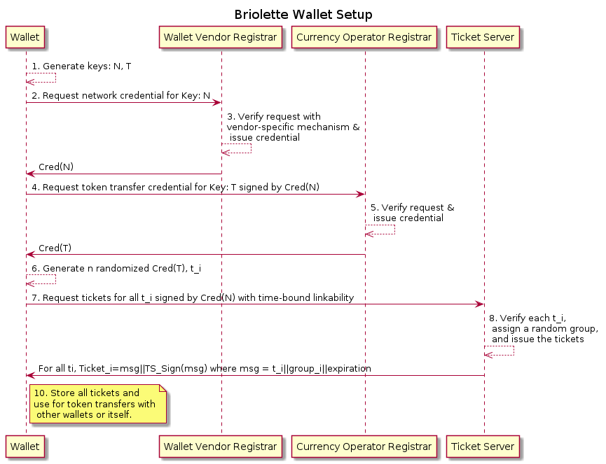
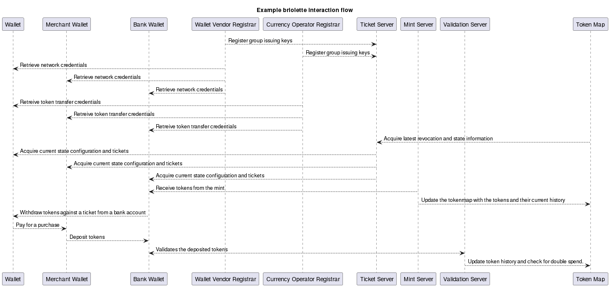

# Theory of operation

This document describes the theory of operation for briolette.  The entire
system is not implemented and there are many places for expanded investigation.

## Token view

### Definition and creation

A token is a piece of metadata which is signed by a "mint". This process
confers value on the token, such a "5".  In addition, the mint also assigns
the first recipient of the token, such as a treasury or the caller performing a
withdrawal.

The initial signature will be special.  In the v0 protocol, it is simply a
randomized ECDSA P-256 signature.

### Transference

The token is then bound to the next recipient.  This binding commits the recipient
to being able to prove to the next recipient that they know the correct secret
information. In the v0, protocol these are [ECDAA](https://fidoalliance.org/specs/fido-v2.0-id-20180227/fido-ecdaa-algorithm-v2.0-id-20180227.html)
randomized credentials and the recipient must create a valid group signature
with the previously bound credential to show that they were the recipient.

Tokens may be transferred infinitely in theory, but in practice, there are two
constraints:

  1. Each verifiable proof of transfer is appended to the token causing it to grow in size.
  2. Each briolette system operator may put a maximum transfer limit on a token.

There are other softer constraints which may be applied as well, such as token
expiration. Additionally, tokens may only be transferred between systems which
prove they are allowed to send or receive those tokens.  For instance, in the
v0 protocol, token transfers will all be signed by credentials for a single
group public key, called the token transfer group (and thus the credentials are
token transfer credentials (TTC)).

The randomized credential that is bound in to the token must also go through a
separate certification process, called ticketing.  For a token to be valid,
its recipient ticket must be valid as well as the transfer history.

This transference is not completely private, however.  The ticketing server
will be able to draw conclusions about which hardware requested which tickets,
and the transference has a specific requirement.  If the same token is
transferred to different recipients (signed tickets), then the transferer will
be discoverable. In the v0 protocol, this is achieved by using the preceding
transfer signature as the "basename" of the transfer signing operation.  This
creates a linkable pseudonym that is only linkable when the signer uses the same
basename.  As the briolette operator becomes aware of the tokens and their history,
then can quickly detect the double spending and extract a pseudonym. More details
can be found in the "wallet perspective" sections about ticketing and revocation.

#### Tagging: splitting and proof of possession (PoP)

Token transfers may carry other "tags" or labels along with them.  In most
cases, only the first transfer from the mint, the token base, carries critical
information, such as the expiration.  However, one tag may be used by any
wallet, and that's the "split" tag.  As wallets are expected to enforce the
security of the business logic and may be caught, as above, if they do not, we
can rely on the participants to "split" a token.

A split is when a token is explictly double spent in that it is signed to
two different destinations. At present, the proof of concept relies on the
double spending detection (in tokenmap) to check for the split tag and then
check the sum, but a future version could allow multiple recipients in one
transfer with the split amount encoded with their signed ticket. (This approach
is more palatable for a production design where the wallet hardware can always
enforce that it will only ever transfer a token _once_.)

Splits give the briolette operator choices.  Splits can be allowed or
disallowed.  If disallowed, all must be of different denominations and include
"change" or fractional amounts. If allowed, splits may be enabled for any
token, e.g., a 20 may become 17.90 and 2.10. Alternatively, splits may be
allowed explicitly for enabling change such that tokens are always either a
whole value or less than 1.00.  The approaches can be mixed too, such that any
token worth more than 1 can be split down to 1.  Then only tokens that are 1
can be split to be less than one.  These decisions will dictate what the "mint"
has to create as well as what logic the participant wallets will need to
transact efficiently.

A second interesting property of splits is the possibility of a 0 value
split. A split that yields the same value token and a 0 value token enables
any given wallet to prove that it possesses the token. The full value is
transferred back to the holder of the token and the empty value split is
sent to the recipient.  This can be useful to prove that funds are held, even
without a guarantee that they will be transferred.  (To limit abuse of 0 value
splits, a maximum transfer limit is strongly recommended.  Otherwise, an
infinite amount of token history can be generated without any real cost to the
attacker.)

### Online validation

Tokens may always be cryptographically verified locally by any participating
device.  Tokens themselves are not secret and can be shared without the risk of
theft or abuse. However, if a wallet is abused, there is a risk that a
cryptographically valid token may be double spent. Participants may be online
or offline at any point, but if they wish to confirm that the tokens they hold
are not double spent (or counterfeit), they can submit them to a validation
server.  The tokens are not transferred to the server, but merely a full copy
of the metadata and provenance is sent.  This allows the validation server to
maintain a viewpoint on the state of tokens across the system and then inform the
caller if their token has been double spent.

If a token is detected as double spent, the validation server cannot "take" the
token from the caller, but it can issue a revocation update for the double
spender to the necessary services as well as issue ticket group revocation
across all participants.  This combination will lead to the tokens being
removed from circulation.  The validation server will offer a destination ticket
and address for the caller to transfer the token to as it is not a legitimate
token.  However, without requiring a proof of possession, there is no way
for the briolette operator to enforce transfer on the caller.

The validation server does not require a proof of possession to allow it to be
called with tokens before they are received.  When a retail transaction occurs,
the spender may propose the tokens to settle with.  If the recipient is online,
they can perform a best-effort validation prior to accepting the funds.  This
would not be possible with a required PoP.

### Trimming and Swapping

When a token's maximum history or its expiration is near, the participant will
want to refresh the the token for continued use.

There are two potential avenues with different tradeoffs.  One path is to trim
the token.  The participant will send a copy of the token to the trimming
server.  The server will "re-mint" the token with a new expiration and the
first recipient being the participant (or the intermediary trimming server).
This approach would ensure the participant would not lose access to the funds
in the event of network partitioning, but it leaves the participant with a
token that is potentially still valid for a few more transfers or prior to its
expiration. The secure wallet may be relied on to properly enforce the trim, but
it does create larger risks and potentially exposes "minting" keys to an online
service.

The other path is to provide a token swap.  The participant sends a copy of
their token to the swap service. The service returns a copy of a similar token.
If the participant is satisfied, it sends the signed transfer to the swap
server address/ticket and the swap server replies with the signed transfer of
the proposed token.  If a network disruption occurs, the participant will need
to retry the request with the pre-signed token which will be useless to them
until they are able to reach the swap server again. Additionally, the swap
server will need access to systems with tokens available for swapping.  While
the risk is lower than providing the ability to mint tokens, there will still
be operational risk to manage.  In many cases, it would make sense for entities
with tokens on hand and the ability to manage them to provide these services on
behalf of the briolette operator.

### Recovery

Because of calls to validation and trim/swap, the briolette operator will have
knowledge of the last known address for a token.  This means that the loss of a
wallet which contains tokens may be recovered from when the tokens have expired and
all tickets issued to the wallet have expired.  If the participant can prove they
were the owner of the lost wallet, e.g., via a pre-established cryptographic binding,
then the briolette operator can treat those lost tokens as "swapped" and issue
new tokens to the new wallet.

## Wallet view

Following the token provided a holistic view of the system, but it only hinted
at some of the wallet requirements. This section will focus on the places which were not
covered above.

### Requirements

Wallets are expected to be a combination of software and hardware which
provides assurance around cryptographic operations, storage, and specific
briolette business logic -- no double spending or out of range splits.  The
assurances are meant to limit the risk the briolette operator is taking on
while also protect participants, or wallet users, from loss due to software
compromise.

The v0 protocol should be realizable on existing secure hardware, but the research
has shown challenges with the existing common APIs.  As newer protocols are designed,
it would be ideal to see secure hardware support richer interfaces around pairing
friendly elliptic curves, for instance.

### Registration

Wallet registration is illustrated in the inline image below:

The wallet must be provisioned with some key matter in its factory such that it
can prove to a registrar that it is a compliant wallet. This process, often
called remote attestation, should take place with a briolette network
registrar.  The network registrar takes in required information in order to
allow a given wallet to connect to other briolette network services.  The
registrar issues a proof to the wallet which allows it to prove to the other
services that it is allowed to interact with them.  The proof must also carry a
binding to the wallet vendor and/or wallet device class. In v0, this network
access credential is a ECDAA credential from a group key tied to the hardware
vendor.

Once the wallet has a network access credential (NAC), it can connect to the
other services, such as validate or trim/swap.  However, to be able to send or
receive tokens, it must connect to the token transfer registrar.  This
registrar is operated by the briolette operator. The transfer registrar
requires a NAC to then acquire a token transfer credential (TTC), or equivalent
token transfer proof if not v0.  The request is performed similarly to a token
transfer, with selective linkability enforced.  With the v0 protocol, the NAC
will sign the request with a fixed basename which will ensure that any TTCs
requested by a specific wallet will be linked together. This means that a
wallet may only have one active TTC at a time, unless their network registrar
enables the creation of multiple NACs.  This linkability, however, does not
reveal the identity of the device or the participant, but simply enforces
per-NAC limits.

### Shared system state and gossip

Every wallet has a baseline set of required shared state.  A wallet must know
what keys and proofs to trust and it must be able to fetch updates.  The
initial trust bundle is supplied during network registration.  The registrar
will provide the state service public keys and the URI to the state services
(and any other required services).

The state service will provide a signed update with an epoch, or time quantum.
This is the time quantum will be used to determine the window of time in which
expirations may occur or ticket issuance may be restricted.  It is also
the expected timeframe for state updates to be released.

The state will include a bare minimum of information and a secure digest to
extended information.  The base minimum is the information which will be
required to be shared between participant wallets on every transaction. It will
include the currrent epoch and a bitfield of group revocations.  Groups are
numbers stored in the tickets, discussed below. If a bit for a group is 1, then
peers will not accept token transfers with that ticket.  Additionally, the peers
may also reject tokens where there are tickets with that group in the same epoch
in the tokens history (which avoids differently compromised wallets from
colluding to "wash" double-spent tokens).

The extended information in an epoch provides the complete trust bundles for
the wallet.  This allows for server and group key rotations in the field.

### Ticketing

The wallet's token transfer credential is required for sender and receiving
tokens, there is still a second step to ensure the briolette operator has
policy control options. The wallet will create some number of randomized
proofs, or randomized TTC credentials for v0, send them to the ticketing clerk
server.  The request will be signed by the NAC with a basename bound to the
current global "epoch".  If the clerk has not issued more tickets to the NAC
pseudonym than desired for the given basename/time, it will sign the credentials
returning them as a "signed ticket".  In v0, much like the mint, the signature
is simply a ECDSA P256 randomized signature with a public key recovery bit.

This signed ticket represents a destination for tokens.  When a wallet wishes
to receive tokens, it must present a valid ticket for the tokens to be bound to.
As tickets are randomized, there is limited linkability of the wallet though
there is still traceability.  A given wallet could transfer the tokens to themselves and
a prior holder or a future recipient would not be able to prove the wallet was
the same, however, the ticketing clerk would be able to link the credentials
via the ticket request.  There are many ways to configure these requests and
the ticket contents which have ramifications on the system privacy.  This is an
area which can be improved upon considerably still.

Tickets do not only contain the certified randomized credentials.  They also
contain an expiration and may contain other policy constraints.  For instance,
each ticket may have a maximum transaction size.  It would not mean the ticket
cannot be used repeatedly to exceed the limit, but this abuse would become
visible to the briolette operator.  In the v0 protocol it would be by linking
the ticket to the NAC and then allow the option of revoking that pseudonym.
However, even without a penalty, these policies can ensure common practices are
upheld in the majority of transactions.

Tickets will also contain randomly assigned groups (though this assignment
process is an interesting area to make changes).  The ticketing clerk will keep
a mapping of group number to NAC group.  As indicated above, this allows for
revocation testing across all members of a NAC only as long as the tickets
associated with the group are valid.

There are some open questions around token transfer from expired tickets.  In
general, it is likely that any tokens held for an extended period should be
transferred between tickets.  However, a swap service would also support
swapping tokens from expired tickets to new tickets by honoring expired ticket
transfers.

### Fixed addresses delegation

Tickets are randomized credentials and reuse of tickets will make all the
transactions linkable to each other via the ticket. However, this may be
acceptable in some usecases.  For instance, a participant may want to exchange
payment addresses with a peer.  They could send them a QR code of one of their
signed tickets.  Then, in the future, the peer could send funds without first
directly negotiation with the other participants wallet.  This would require that
the wallet requests one or more longer lived tickets.

Peer addressing is not the only usecase. Longer lived tickets have utility in
the retail space.  A signed ticket may contain the tax identifier or other
information the briolette operator may have validated for a business.  With
this information in a ticket, a retail customer may be sure they are
transferring tokens to the merchant they are at.  Additionally, since there are
no secrets laden in tokens, these longer lived tickets could be stored in
point-of-sales devices or webservers where tokens may be transferred (and
validated!) even though the host itself does not have a valid wallet.

### Revocation

Both the shared state and ticketing sections have covered how revocation
happens.  These sections, however, are incomplete.  Quick revocation in the
field via gossiped state is necessary, but what happens next?  When a
revocation occurs, the gossiping system is meant to quickly reduce the abuse
possible in the field.  It is meant to fill the gap before the tickets expire
-- especially for long lived tickets.  Revocation in the field is expensive,
however, and undesirable to carry over time.  Instead, the more effective
revocation is enforced at the network service layer.

At some point, all wallets must connect to the ticketing clerk to maintain the
ability to send or receive funds.  Here the wallet will make a request with its
NAC. If its NAC is part of a revoked groups, it will be referred back to its
network registrar to request a new credential.  The network registrar (or the
ticket clerk) will challenge the wallet to sign a nonce with the basename (for
v0) of the abusive wallet's ticket request.  This will determine if the wallet
was the abuser.  This will allow the briolette operator to request the wallet be
provided for analysis to help root cause the double spending.  For v0
protocols, the network registrar will need to implement this as it is likely to
have knowledge if a wallet has a network credential and can enforce this check
prior to issuing a new credential for a non-revoked network group public key.

It is also possible to challenge the wallet using the TTC and the double
spending basename, but without additional information, the ticketing clerk
would need to challenge every request and not just requests from specific
hardware.  This is a useful tool in the case of expansive token abuse, but not
expected to be the most common mechanism

## Pulling it together: an example flow

